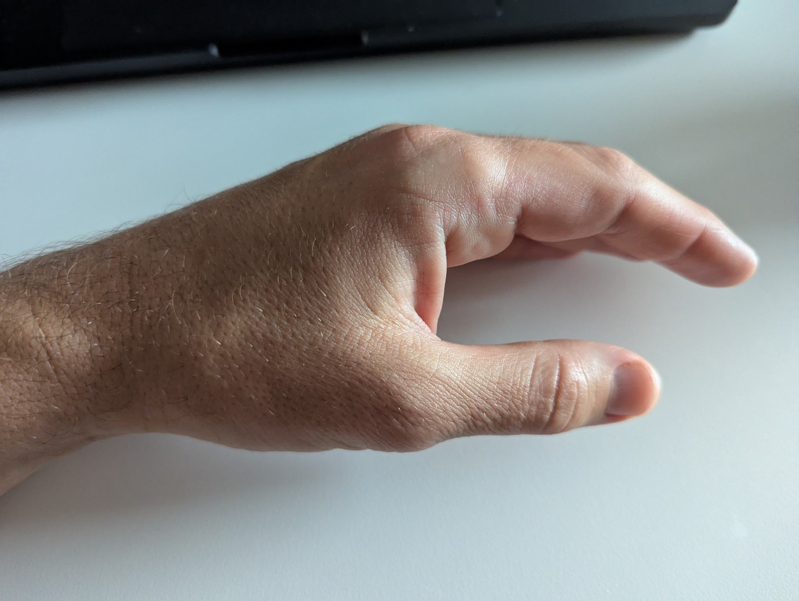
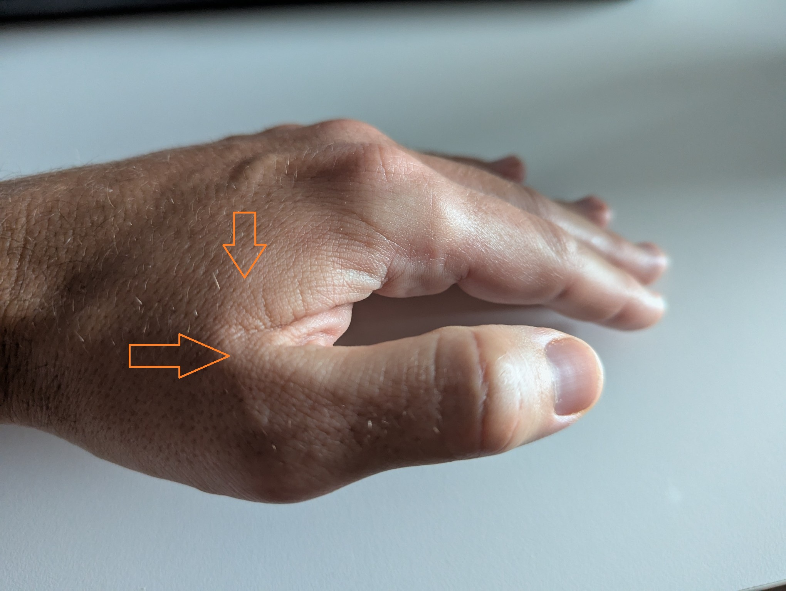
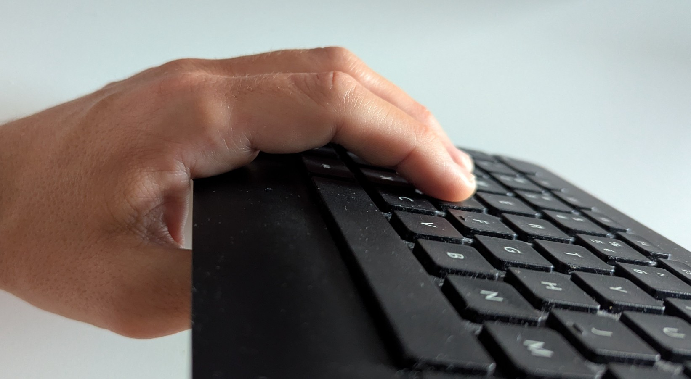
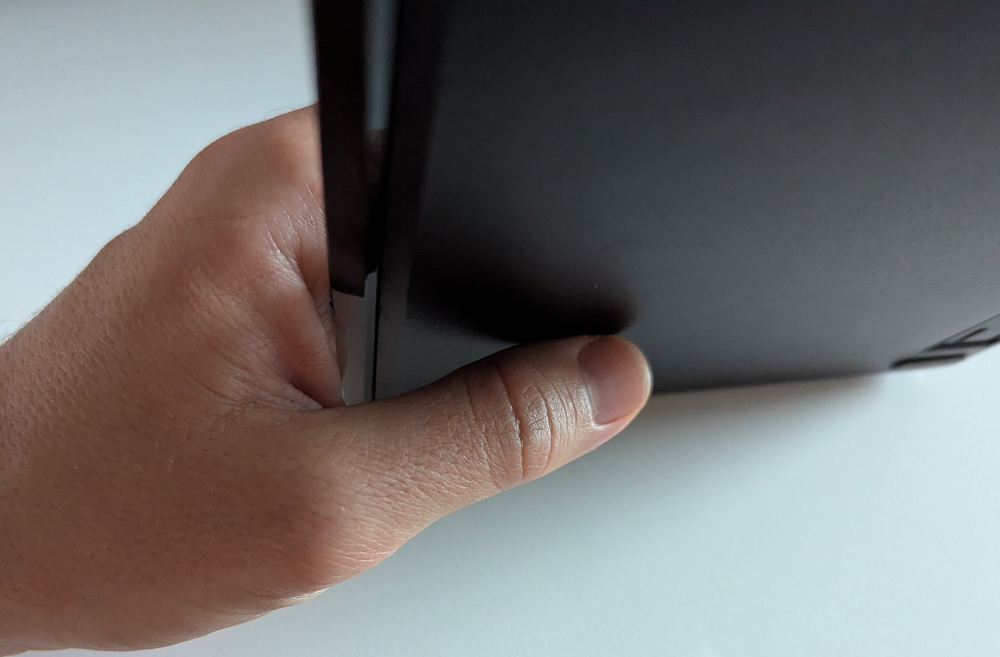
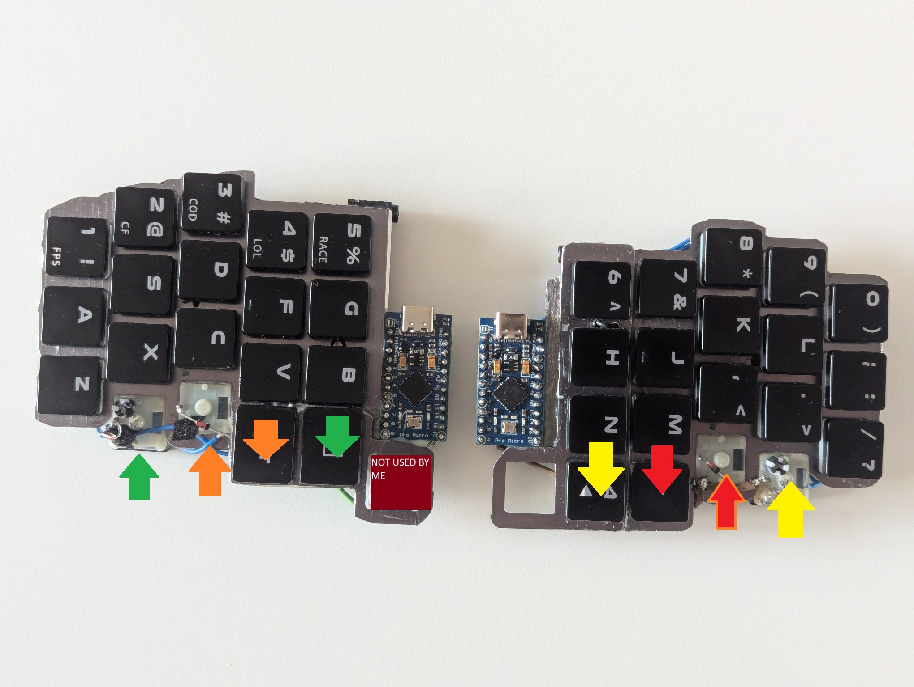
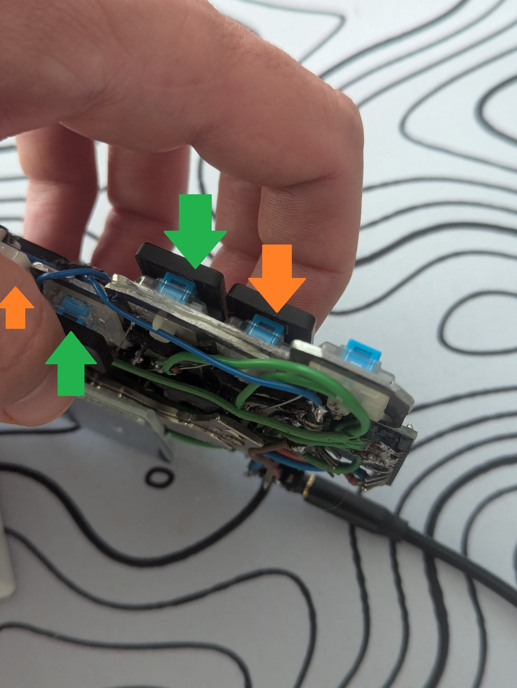
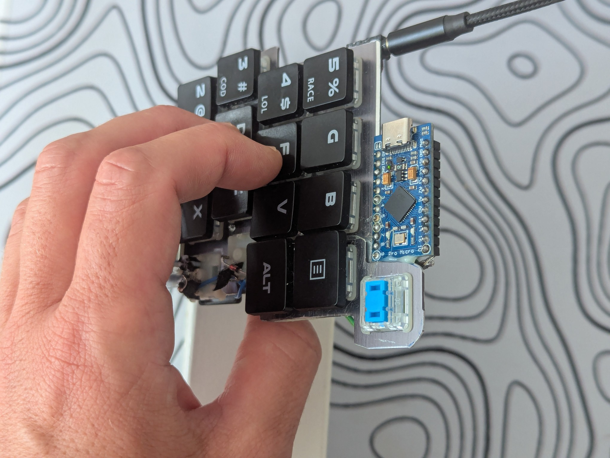
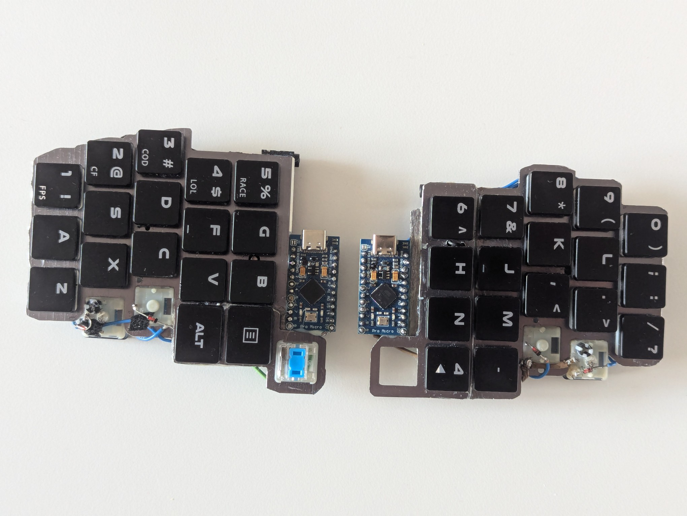

# Keyformers

## Tools and materials 
- used keyboard (ideally low profile and with a metal body)
- 2 MCUs
- Wire 
- Diodes
- isolation tape
- light glue
- strong glue like epoxy (ideally metal bond)
the cost of entire keyboard was around 20 USD. It mostly depends on the cost of the used keyboard. 

## Goal
This is my natural hand position

In order to operate a keyboard buttons with a thumb I have to lift my thumb up and strain the muscles next to my thumb (marked on the photo below - I am overexaggerating a bit).

So why not use a keyboard in hands natural position, so that I do not have to keep my thumb lifted all the time....

... there are no buttons (e.g. space and alt) on the bottom of a keyboard case.

Lets add them. I will keep the Alt and Space on both sides of the keyboard:
- Top - for backward compatilibity so that I can still use my keyboard in old fashioned way.
- Bottom - to promote natural hand placement like on the photo.
So I will have two Alts and two spaces. 

Same color of buttons means that the keys do the same thing. Arrow down means the button is operated from the top (like we used to operate a keyboard). Arrow up means the button is operated from the bottom of the case.

Here is how the keyboard is operated (it has to be tented):

There are actually 39 buttons on that keyboard. The 1 without a keycap - I am not using anymore due to that 36->34 change (I was to lazy to desolder that). 4 reversed buttons, that I am clicking with my thumb from the other side (from the bottom of the keyboard). So both thumb clusters are duplicated. and accessible from both sides of the keyboard.

## Build 
Disassemble the keyboard

Desolder the keyboard

Experiment with the layout for both hands

Cut the keyboard frame/body into pieces

Glue the pieces together with epoxy/metal bond

Attach switches. MX keycaps can be flipped by 90 degrees. Choc keycaps cannot (that is why my keycaps are rotated by 90 degrees). Glue them to the frame with some weak glue and solder the rows (I actually do not recommend using that tape - it makes replacing switches more difficult).

Glue the MCU to the keyboard and solder that to the rows

Glue the TRRS connectors and solder them to the MCU. Solder the columns (with diodes).
I've used two magnets as the case. They are attached with a separators (so that they do not squeeze the wiring). I am only intending to use that keyboard on a tenting kit anyway.
I've started to make this as a 36 key keyboard but in the meantime I've decided to go to 34 only (it is not comfortable to operate 3 buttons for me with a thumb).

Repeat the processed on the second half.

> [!NOTE]
> I've used a terrible solder from AliExpress during this build. Not only the soldering looks bad but also the product was not durable. I've had several instances when the soldering broke and I had to resolder it again. After a couple failures like that I've resoldered entire right hand side with a new solder (and without the soldering tape).
