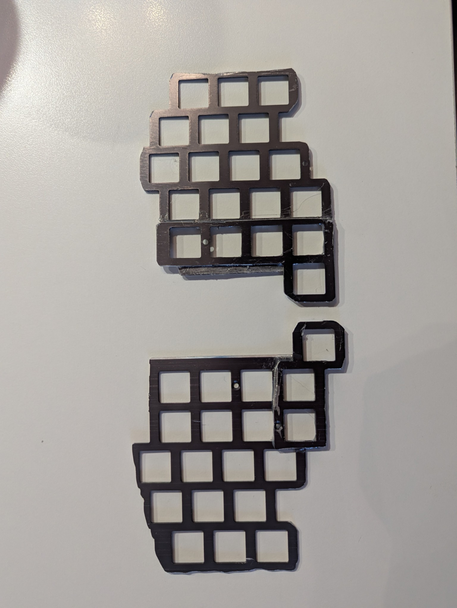

# Keyformers

## Tools and materials 
- used keyboard (ideally low profile and with a metal body)
- 2 MCUs
- Wire 
- Diodes
- isolation tape
- light glue
- strong glue like epoxy (ideally metal bond)

## Build 
Disassemble the keyboard

Desolder de keyboard

Experiment with the layout for both hands

Cut the keyboard frame/body into pieces

Glue them together with epoxy/metal bond

Attach switches. glue them to the frame with some weak glue and solder the rows (I actually do not recommend using that tape - it makes replacing switches more difficult)

Glue the MCU to the keyboard and solder that to the rows

Glue the TRRS connectors and solder them to the MCU. Solder the columns (with diodes).
I've used two magnets as the case. They are attached with a separators (so that they do not squeeze the wiring). I am only intending to use that keyboard on a tenting kit anyway.
I've started to make this as a 36 key keyboard but in the meantime I've decided to go to 34 only (it is not comfortable to operate 3 buttons for me with a thumb).

There are actually 39 buttons on that keyboard. The 1 without a keycap - I am not using anymore due to that 36->34 change (I was to lazy to desolder that). 4 reversed buttons, that I am clicking with my thumb from the other side. So both thumb clusters are duplicated. and accessible from both sides of the keyboard. 

Repeat the processed on the second half.

> [!NOTE]
> I've used a terrible solder from AliExpress during this build. Not only the soldering looks bad but also the product was not durable. I've had several instances when the soldering broke and I had to resolder it again. After that I've resoldered entire right hand side with a new solder. 
